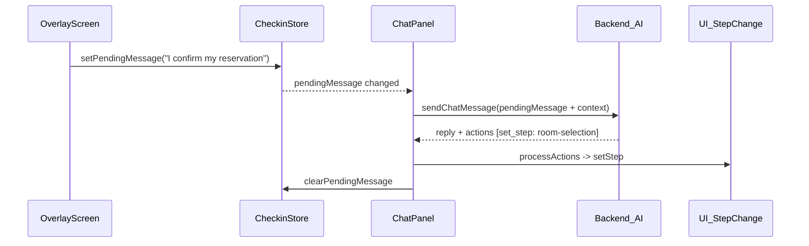

# AI-Driven Check-in Flow Transitions

## Problem

Currently, overlay screens (ReservationFound, RoomSelection, UpgradeOffer) have hard-coded "Continue" / "Confirm & Continue" buttons that call `setStep()` directly, bypassing the AI avatar entirely. This creates a disconnect: the AI is talking, but the user has to click buttons to advance, and the AI has no awareness of the transition.

## Architecture

The core idea: **screen confirmation buttons send a message to the AI instead of directly changing steps**. The AI acknowledges the action, responds naturally, and uses its existing `set_checkin_step` tool to advance the UI.

## Changes

### 1. Checkin Store -- add `pendingMessage` ([frontend/src/stores/checkinStore.ts](frontend/src/stores/checkinStore.ts))

Add two new fields to the store:

- `pendingMessage: string | null` -- message queued by a screen button
- `setPendingMessage: (msg: string | null) => void`

This is the bridge between overlay screens and the ChatPanel.

### 2. ChatPanel -- watch and auto-send pending messages ([frontend/src/components/conversation/ChatPanel.tsx](frontend/src/components/conversation/ChatPanel.tsx))

- Subscribe to `pendingMessage` from the checkin store
- Add a `useEffect` that calls `handleSendMessage(pendingMessage)` when it becomes non-null, then clears it
- Extend `buildContext()` to include `selectedRoom` and `selectedUpgrade` so the AI sees what the user picked on screen

### 3. ReservationFoundScreen -- AI-driven confirm ([frontend/src/components/checkin/ReservationFoundScreen.tsx](frontend/src/components/checkin/ReservationFoundScreen.tsx))

- **"Confirm & Continue"** button -> calls `setPendingMessage("Yes, that's my reservation. Please proceed.")` instead of `setStep('room-selection')`
- **"Not Me"** button -> calls `setPendingMessage("That's not my reservation.")` instead of `setStep('identify')`

Both paths now go through the AI so it responds naturally.

### 4. RoomSelectionScreen -- AI-driven confirm ([frontend/src/components/checkin/RoomSelectionScreen.tsx](frontend/src/components/checkin/RoomSelectionScreen.tsx))

- Keep room card selection UI exactly as-is (clicking a card still calls `setSelectedRoom`)
- **"Continue"** button -> calls `setPendingMessage("I'd like Room {roomNumber}, the {type} room.")` instead of `setStep('upgrade-offer')`
- **"Back"** button -> calls `setPendingMessage("Actually, let me go back to review my reservation.")` instead of `setStep('reservation-found')`

### 5. UpgradeOfferScreen -- AI-driven confirm ([frontend/src/components/checkin/UpgradeOfferScreen.tsx](frontend/src/components/checkin/UpgradeOfferScreen.tsx))

- Keep upgrade card selection UI exactly as-is
- **"No Thanks"** button -> calls `setPendingMessage("No upgrade for me, let's proceed to payment.")` instead of directly setting step
- **"Accept Upgrade"** button -> calls `setPendingMessage("I'd like the {toRoomType} upgrade please.")` instead of directly setting step
- **"Back"** button -> similarly AI-driven

### 6. Update system prompt ([backend/src/prompts/concierge.ts](backend/src/prompts/concierge.ts))

Refine the "Check-in Conversation Flow" section to explicitly instruct the AI that:

- When the guest confirms their reservation, call `set_checkin_step('room-selection')` and present room options
- When the guest confirms a room, call `set_checkin_step('upgrade-offer')` 
- When the guest declines or accepts an upgrade, call `set_checkin_step('payment')` and `trigger_payment`
- The AI should always respond conversationally AND advance the step in the same turn

### 7. Extend context in `buildHotelContext` ([backend/src/prompts/concierge.ts](backend/src/prompts/concierge.ts))

Add `selectedRoom` and `selectedUpgrade` fields so the AI knows what the guest has selected on-screen when processing their confirmation message.

## What Does NOT Change

- Room card and upgrade card click-to-select interactions remain identical
- PassportScanScreen, PaymentScreen, KeyCardScreen flows stay the same (already AI-driven or auto-processed)
- Backend AI tools (`set_checkin_step`, `trigger_payment`, etc.) remain unchanged
- Voice input / voice output pipeline unchanged
- `useCheckin` hook functions (`handlePayment`, `handleCompleteCheckin`, etc.) unchanged