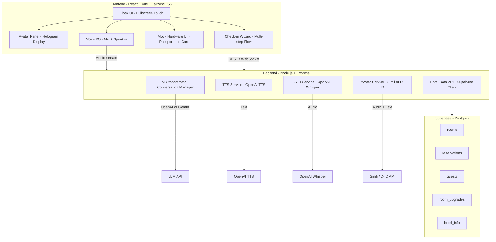
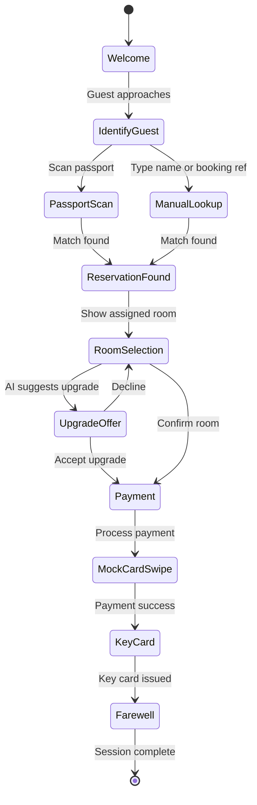

# AI Hotel Check-in Kiosk -- Project Scaffold

## Architecture Overview



## Tech Stack

| Layer | Technology | Why |

|---|---|---|

| Frontend | **React 18 + Vite + TypeScript** | Fast dev, huge ecosystem, works great for kiosk UIs |

| Styling | **Tailwind CSS** | Rapid UI development, easy holographic/glassmorphism effects |

| State | **Zustand** | Lightweight, simple -- no Redux boilerplate |

| Backend | **Node.js + Express + TypeScript** | Keeps AI API keys server-side, easy WebSocket support |

| Realtime | **Socket.IO** | Streaming AI responses + avatar sync to frontend |

| Database | **Supabase** (hosted Postgres) | Free tier, instant REST API, easy to seed mock data |

| AI Chat | **OpenAI GPT-4o** (primary), Gemini (fallback) | Best conversational quality for the concierge persona |

| TTS | **OpenAI TTS** (`tts-1-hd`) | Natural voice, easy API, multiple voice options |

| STT | **OpenAI Whisper API** + browser SpeechRecognition (fallback) | Accurate transcription, works offline via browser fallback |

| Avatar | **Simli** (recommended) or **D-ID** | Real-time talking-head avatar from audio -- perfect for hologram kiosk |

| Deployment | **Docker Compose** | Same containers run on laptop and Jetson |

## Project Structure

```
ai-checkin-robot/
├── frontend/                         # React + Vite app
│   ├── public/
│   │   └── assets/                   # Avatar images, hotel branding, sounds
│   ├── src/
│   │   ├── components/
│   │   │   ├── avatar/               # AvatarDisplay, HologramOverlay
│   │   │   ├── checkin/              # WelcomeScreen, PassportScan, RoomSelect,
│   │   │   │                         # PaymentScreen, KeyCardScreen, FarewellScreen
│   │   │   ├── hardware/             # MockPassportScanner, MockCardReader
│   │   │   ├── conversation/         # ChatPanel, VoiceButton, TranscriptDisplay
│   │   │   └── ui/                   # Button, Card, Modal, ProgressBar (shared)
│   │   ├── hooks/
│   │   │   ├── useVoiceInput.ts      # Microphone capture + STT
│   │   │   ├── useVoiceOutput.ts     # Play TTS audio + sync avatar
│   │   │   ├── useAvatar.ts          # Avatar stream management
│   │   │   └── useCheckin.ts         # Check-in flow state machine
│   │   ├── services/
│   │   │   ├── api.ts                # Axios/fetch client to backend
│   │   │   ├── socket.ts            # Socket.IO client
│   │   │   └── supabase.ts          # Supabase client (read-only for hotel info)
│   │   ├── stores/
│   │   │   ├── checkinStore.ts       # Check-in session state (Zustand)
│   │   │   └── conversationStore.ts  # Chat history + AI state
│   │   ├── types/
│   │   │   └── index.ts             # Shared TypeScript types
│   │   ├── utils/
│   │   │   └── hologramEffects.ts   # CSS/canvas hologram effect helpers
│   │   ├── App.tsx
│   │   └── main.tsx
│   ├── index.html
│   ├── tailwind.config.ts
│   ├── vite.config.ts
│   ├── tsconfig.json
│   └── package.json
│
├── backend/                          # Express API server
│   ├── src/
│   │   ├── routes/
│   │   │   ├── chat.ts              # POST /api/chat -- AI conversation
│   │   │   ├── voice.ts             # POST /api/tts, POST /api/stt
│   │   │   ├── avatar.ts            # POST /api/avatar/speak -- trigger avatar
│   │   │   ├── checkin.ts           # Check-in flow endpoints
│   │   │   └── hotel.ts             # GET /api/rooms, /api/hotel-info, etc.
│   │   ├── services/
│   │   │   ├── aiService.ts         # OpenAI / Gemini orchestration
│   │   │   ├── ttsService.ts        # OpenAI TTS wrapper
│   │   │   ├── sttService.ts        # Whisper API wrapper
│   │   │   ├── avatarService.ts     # Simli / D-ID API wrapper
│   │   │   └── hotelService.ts      # Supabase queries for hotel data
│   │   ├── prompts/
│   │   │   └── concierge.ts         # System prompt for AI concierge persona
│   │   ├── config/
│   │   │   └── index.ts             # Env vars, API keys config
│   │   ├── middleware/
│   │   │   └── errorHandler.ts
│   │   ├── socket.ts                # Socket.IO server setup
│   │   └── index.ts                 # Express app entry point
│   ├── tsconfig.json
│   └── package.json
│
├── supabase/                         # Database setup
│   ├── migrations/
│   │   └── 001_initial_schema.sql   # Tables: rooms, reservations, guests, etc.
│   └── seed.sql                      # Mock hotel data (rooms, prices, amenities)
│
├── hardware/                         # Hardware abstraction (shared types/config)
│   ├── README.md                     # Wiring guide for Jetson peripherals
│   └── jetson-config.ts              # Jetson-specific display/audio settings
│
├── docker-compose.yml                # Run frontend + backend together
├── docker-compose.jetson.yml         # Jetson-specific overrides
├── .env.example                      # All required env vars documented
├── package.json                      # Root workspace (npm workspaces)
└── turbo.json                        # (Optional) Turborepo config for monorepo
```

## Check-in Flow (State Machine)



## Key Design Decisions

### 1. Avatar Integration (Simli recommended)

- **Simli** provides a real-time streaming avatar API: you send audio, it returns a video stream of a photorealistic face speaking those words.
- The frontend embeds this as a video element with holographic CSS effects (scan lines, blue tint, glow, transparency).
- Fallback: D-ID's `/talks` API generates short video clips per utterance.
- The avatar component will be wrapped in a `HologramOverlay` that adds the futuristic visual effects.

### 2. Voice Pipeline

```
Guest speaks -> Mic capture (browser MediaRecorder API)
  -> Backend /api/stt (Whisper) -> transcribed text
  -> Backend /api/chat (GPT-4o with hotel context) -> AI response text
  -> Backend /api/tts (OpenAI TTS) -> audio buffer
  -> Backend /api/avatar/speak (Simli) -> avatar video stream
  -> Frontend plays audio + avatar video simultaneously
```

All streamed via Socket.IO for low latency.

### 3. Mock Hardware

- **Passport Scanner**: A UI panel that shows a realistic scanner animation. Clicking/tapping "Scan" triggers a fake delay, then returns mock passport data (name, nationality, passport number).
- **Credit Card Reader**: Same approach -- shows a card slot animation, fake processing, returns success.
- These are abstracted behind interfaces so real hardware drivers can be swapped in later on the Jetson.

### 4. Hologram Effect (CSS/Canvas)

On a regular screen (laptop dev), the avatar appears with:

- Glassmorphism backdrop (`backdrop-filter: blur`)
- Animated scan lines overlay
- Blue/cyan color grading
- Subtle flicker animation
- Glow/bloom effect around the avatar

On the Jetson with a Pepper's Ghost display, the same video feeds to the transparent display panel.

### 5. AI Concierge Persona

The system prompt will instruct the LLM to act as a luxury hotel concierge with access to real hotel data (rooms, amenities, local recommendations). It will use function calling to look up reservations, check room availability, and process upgrades.

### 6. Laptop vs Jetson

- Same Docker containers run on both.
- `.env` toggles hardware mode: `HARDWARE_MODE=mock` (laptop) vs `HARDWARE_MODE=jetson` (production).
- On laptop, all hardware is mocked in the UI. On Jetson, real GPIO/USB drivers can be plugged in.

## Implementation Order

The scaffold will be built in phases, with each phase producing something runnable:

1. **Phase 1**: Project scaffolding -- monorepo setup, frontend + backend boilerplate, Supabase schema + seed data
2. **Phase 2**: Core UI -- kiosk layout, check-in wizard screens, hologram effects, mock hardware panels
3. **Phase 3**: AI integration -- chat endpoint, system prompt, OpenAI/Gemini service, conversation flow
4. **Phase 4**: Voice pipeline -- STT (Whisper), TTS (OpenAI), mic capture hooks, audio playback
5. **Phase 5**: Avatar integration -- Simli/D-ID API, avatar display component, audio-video sync
6. **Phase 6**: Polish -- animations, transitions, error handling, Jetson Docker config