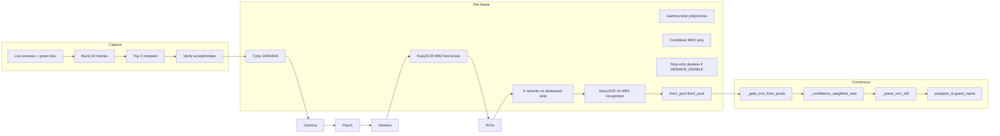

# Passport Scanner Pipeline – Full Audit

This document describes the **entire passport scanner pipeline** end-to-end: capture flow (before/after photo), each image filter and when it is used, EasyOCR usage at each stage, which models do what, which passport regions are checked, how the passport number is identified and corrected, and how wrong numbers are fixed by the user. It is a read-only audit; no code changes are implied.

---

## 1. Entry points and modes

| Entry                    | Script / API                                                                                   | When used                                                                                                                                                                         |
| ------------------------ | ---------------------------------------------------------------------------------------------- | --------------------------------------------------------------------------------------------------------------------------------------------------------------------------------- |
| **Interactive (camera)** | [main.py](../main.py) → `scan_passport()` in [core/scanner.py](../core/scanner.py)            | Full check-in flow: user aligns passport, presses Space/Enter, sees verification dialog, then OCR runs.                                                                           |
| **Frames provided**      | `scan_passport_from_frames(frames)` or `scan_passport_from_frame(frame)` in [core/scanner.py](../core/scanner.py) | Upstream pipeline (e.g. [PIPELINE_INTEGRATION.md](PIPELINE_INTEGRATION.md)) or test (e.g. run_test_image.py).                                                                   |
| **Backend one-shot**     | POST `/api/checkin/scan-passport` → runs `backend/scripts/scan_passport.py` (when `PASSPORT_SCANNER_ENGINE=easyocr`) | [backend/src/routes/checkin.ts](../../../backend/src/routes/checkin.ts): `execFile(pythonBin, [scriptPath], ...)`; script uses camera + same pipeline.                           |
| **Backend polling**      | Async scan → spawns [scan_passport_easyocr_poll.py](../../../backend/scripts/scan_passport_easyocr_poll.py)      | [checkin.ts](../../../backend/src/routes/checkin.ts) line 235: continuous camera poll, sharpness gate, `scan_passport_from_frame(..., require_detection=True)` until MRZ found or timeout. |

`scan_passport_poll.py` is **deprecated** (no OCR); it exits with a JSON error directing callers to `scan_passport_easyocr_poll.py`.

---

## 2. Before photo is taken

- **Camera open**: [core/scanner.py](../core/scanner.py) `_open_camera()` uses `CAMERA_INDEX` (from .env), 1920×1080; on Windows uses `CAP_DSHOW` for USB.
- **Live preview**: `_capture_frames_from_camera("passport")` shows a **green alignment rectangle** (PASSPORT_RECT_W=1040, PASSPORT_H=640) centered on the frame. User aligns the passport inside this box.
- **Capture trigger**: **Space or Enter** triggers capture; **Esc** cancels.
- **Burst + sharpness**: On trigger, `_capture_best_frames(cap, num_frames=10, interval_ms=75, top_k=2)` grabs 10 frames, scores each with `_sharpness_score()` (Laplacian variance on center 60% of frame), keeps the **top 2 sharpest** raw frames. No filters applied yet.
- **Verification (interactive only)**: `_show_capture_for_verification(frames[0])` shows the **first captured frame** (cropped to alignment region, resized to max 800px) and asks "Is this image clear? Use it for OCR or retake." **Use this** / Enter = accept; **Retry** / R = re-run capture. So "before" = live preview + burst + accept/retake; "after" = the same raw frames then fed into the pipeline below.

In **polling mode** ([scan_passport_easyocr_poll.py](../../../backend/scripts/scan_passport_easyocr_poll.py)) there is no user verification: each frame is sharpness-checked (`SHARPNESS_THRESHOLD`, default 15); if below threshold the frame is skipped. Then `scan_passport_from_frame(frame, require_detection=True)` runs; if no MRZ lines are detected, the frame is skipped without running the 5-variant OCR.

---

## 3. After photo is taken – per-frame pipeline (one or two frames)

For each frame (or single frame in polling), the following happens in order.

### 3.1 Crop and optional gamma

- **Crop**: `_crop_passport_alignment_region(frame)` – center 1040×640 region (same as the green box).
- **Gamma + global tone**: `_preprocess_passport_alignment_crop` applies gamma (`SCAN_GAMMA`), global brightness/contrast, and optional sat/denoise/sharp per `.env`. **No full-page deskew** — the alignment crop may remain tilted for detection and for the saved `passport_image_base64`.

### 3.2 Pass 2: MRZ line detection (EasyOCR #1 on passport path)

- **Input**: The **preprocessed alignment crop** (same pixels used for storage/API).
- **EasyOCR**: `_detect_mrz_lines_with_easyocr(passport_page)`:
  - Builds **CLAHE master** from the full crop.
  - Runs `reader.readtext(clahe_master, width_ths=1.0, add_margin=0.15)` on the **full image** (MRZ can be anywhere).
  - **TD3 Line 1 anchor**: Looks for a block matching `P[<A-Z][A-Z]{3}` with length ≥ 10 and aspect ≥ 3.0. If found, that block is **Line 1**; any blocks on the same visual line (merge by mid_y) are merged; then the **next** wide block below is **Line 2**. Returns two boxes.
  - **Fallback (no P< anchor)**: Filters blocks by length 15–70 chars, width ≥ 5× height, and **chevron density** (`<` count / length) ≥ 5%. Sorts by mid_y and chevron density, takes top 2 lines, returns two boxes.
- **Box expansion**: Each box is expanded to **full width** (98% of image width, centered) and given a vertical buffer (10px + for Line 2 extra 14px bottom) via `_expand_mrz_box_full_width`.

### 3.3 Combined MRZ strip: deskew (MRZ-only) then recognition

- **Crop**: Vertical union of expanded boxes → `combined_roi` from the alignment crop.
- **Strip deskew**: `_deskew_passport_mrz_combined_roi(combined_roi)` — CLAHE + EasyOCR **on the strip only** for box angles; **Hough on the full strip** (`bottom_frac=1.0`, not a fraction of the passport page). Optional **row-projection refine** on the **entire** strip (`DESKEW_REFINE_PASSPORT` + `DESKEW_REFINE_*_DEG`). Cache key `passport_mrz` when `DESKEW_CACHE_ANGLE` is on (first frame measures; later frames reuse tilt). Rotates **only** the strip.
- **Debug**: `mrz_strip_detection_boxes_frame_*.png`, `mrz_strip_deskew_debug_frame_*.png`, `deskew_tilt_passport_mrz_frame_*.png`, `deskew_debug_zone_passport_mrz_frame_*.png` under `debug/variants/passport/`.
- **ROI for recognition**: After deskew, `_build_six_variants` runs on the **deskewed** strip; `_shotgun_ocr_mrz_on_variant_images` splits results into **line1_pool** / **line2_pool** using y-bands scaled to the post-deskew strip height plus TD3 text gates.

If **no** MRZ lines are detected and `require_detection=True` (e.g. polling), the function returns immediately and no 5-variant OCR is run. If no boxes and `require_detection` is false, **optional** `fallback_boxes` from a previous frame can supply coordinates; their union is OCR'd the same way. There is **no** fixed multi-band sweep elsewhere on the image.

---

## 4. Filters (5 OCR variants) – when and where

**Five** variant images are built for the **single combined MRZ strip** only (passport never builds the old full-page `f*_v*.png` stack). Card ROIs use the same `_build_six_variants` helper separately. Passport strip variants use `_build_six_variants` on the deskewed strip when `DESKEW_ENABLE` is on, else on the **non-deskewed** combined strip.

- **v1 (v1_orig)**: Raw ROI copy.
- **v2 or v3 (one sharp)**: Either `_sharpen_for_ocr(v1)` **or** medianBlur + sharpen (`OCR_USE_V3_BASE`); only **one** is kept as the sharp base.
- **v4 (v4_gray)**: Grayscale of that sharp base.
- **v5 (v5_lab_clahe)**: Grayscale → BGR, then **LAB**; CLAHE on **L** only (`SCAN_CLAHE_CLIP`, grid 8×8); **LAB2BGR** (neutral chroma from gray lift).
- **v6 (v6_lab_clahe)**: Same **LAB L-channel CLAHE** on the **color** sharp BGR image (no grayscale step).

**Optional**: If `SCAN_VARIANT_SECOND_SHARPNESS` is greater than 0, an additional median-unsharp pass (same strength scale as `SCAN_VARIANT_SHARPNESS`) is applied **on top of** v2–v6 after they are built; **v1_orig** is unchanged.

**When**: For the **one** combined MRZ ROI, **1 combined ROI × 5 variants = 5 EasyOCR `readtext` calls** for MRZ recognition, **plus 1** for MRZ line detection on the full alignment crop, **plus 1** for strip deskew box detection when that path runs (first frame or cache off).

---

## 5. EasyOCR usage – where and what for

- **Model**: Single EasyOCR **Reader** (English, `["en"]`), loaded once via `_get_easyocr_reader()`. Uses `easyocr_models/` or `EASYOCR_MODULE_PATH` if present (offline); otherwise may download. **One model** is used for both detection and recognition.
- **Calls**:
  1. **MRZ line detection**: `reader.readtext(clahe_master, width_ths=1.0, add_margin=0.15)` on the **full alignment crop** – **detection** to find two MRZ line boxes; text is used only for anchor/chevron logic.
  2. **MRZ strip deskew (when enabled)**: `reader.readtext(clahe_master)` on the **combined MRZ strip** – **detection only** for tilt (often 0°; Hough supplies angle). Skipped on later frames when `DESKEW_CACHE_ANGLE` reuses tilt.
  3. **Combined MRZ strip × 5 variants**: `_shotgun_ocr_mrz(variant_image)` calls `reader.readtext(image, detail=1)` on **each** of the 5 variant images of the combined strip (**deskewed** if `DESKEW_ENABLE`, else **original** strip). **Recognition** happens here; stitching + *mid_y* routing to **line1_pool** / **line2_pool** (y-bands + TD3 gates).

So: **EasyOCR is used for** (1) finding Line 1 / Line 2 boxes on the page crop, (2) optional strip-level box pass for deskew, (3) reading text from 5 variants of that combined MRZ strip only.

---

## 6. MRZ OCR aggregation and stitching (`_shotgun_ocr_mrz`)

- For each variant image, `reader.readtext(image, detail=1)` returns detections. Each detection is kept as (text, confidence).
- **Stitching**: Detections are grouped by **horizontal line** (mid_y within 1.2× median block height). Within each line, blocks are sorted by x; between blocks, if gap > 4% of ROI width, a single `<` is inserted. Concatenated string per line is added to the pool with average confidence.
- **Line 1 split fix**: If a line looks like a TD3 Line 1 prefix (`P<` or `P[A-Z]`) and there is another line below with no digits and with `<<`, that lower line is merged as a second part of Line 1 (e.g. surname<<given split across two EasyOCR rows). Merged string is added with *mid_y* anchored on the `P<` row so it routes to **line1_pool** only.
- Raw / stitched (text, confidence, *mid_y*) entries are routed to **line1_pool** or **line2_pool** (or neither if rejected by line-specific gates), not duplicated wholesale. Multiple frames: pools are **merged** (all_l1, all_l2).

---

## 7. Which part of the passport is checked (MRZ only)

- **Geometric**: Only the **two MRZ lines** (ICAO 9303 TD3, 44 characters each) are read. They are located by:
  - **Preferred**: EasyOCR detection on the full deskewed image, using P< (or P + letter) + 3-letter country code as Line 1 anchor, then the next wide line below as Line 2.
  - **Fallback (detection only)**: High chevron-density, long, wide text lines to infer two boxes when there is no `P<` anchor. If detection returns no boxes, **no** MRZ OCR runs on alternate image bands (unless multi-frame `fallback_boxes` from a prior detection are supplied).
- **No other zones**: The pipeline does **not** OCR the photo, the date of birth field above the MRZ, or other printed fields for passport data. **Passport number and name** come **only** from the two MRZ lines (see next section).

---

## 8. How the passport number is identified (TD3 layout + checksums)

- **Source**: ICAO 9303 **TD3** (travel document, 2 lines of 44 characters).
  - **Line 1**: Positions 0–1 = document type (e.g. `P<`); 2–4 = issuing country; **5–43** = name block (SURNAME<<GIVEN1<GIVEN2…).
  - **Line 2**: **Positions 0–9** = document number (9 chars) + **check digit** (1 char). Positions 13–19 = DOB + check digit; 21–27 = expiry + check digit; 43 = composite check digit.
- **Extraction**: `_parse_mrz_td3(line1, line2)`:
  - **passport_id** = `line2[0:9].replace("<", "").strip()` (document number only; digit at position 9 is the check digit, not part of the ID).
  - **guest_name** = from line1[5:44]: split by `<<` into surname and given, then `"given surname"`.
- **How we know it's the passport number**: By **position**. In TD3, the document number is **always** positions 0–9 of Line 2; the code does not search for a "passport number" label. Validity is enforced by **check digits** (see below).

---

## 9. Gating and checksums (wrong vs right number)

- **Line 2 candidates**: From the raw pools, `_gate_mrz_from_pools(line1_pool, line2_pool)` builds **valid_line2s**. For each OCR string, `_best_td3_line2_candidate(loose)`:
  - Slides a 44-char window over the normalized string; rejects windows that look like Line 1 (`P<` or `P[A-Z]`).
  - For each window, tries **single-character corrections** at digit positions 9, 19, 27, 43 (`_mrz_try_single_char_corrections`): O→0, I/L→1, Z→2, S→5, B→8, G→6, etc.
  - **Checksums** (ICAO 9303, 7-3-1 weight, mod 10): document number (0–9), DOB (13–19), expiry (21–27), composite (0–10, 13–20, 21–43). Picks the 44-char window with the **most** checksums passed.
  - **Relaxed doc-number check**: `_try_passport_check_digit_o0`: if position 9 is a letter (e.g. O read as 0), try substituting known confusions; if the 9-digit document number then passes the check digit, the candidate is accepted. So "wrong" OCR at the **check digit** position can be auto-corrected.
- **Line 1 candidates**: Extracted from same pools by anchoring at `P<` or `P[A-Z]` and taking 44-char windows with issuing state A-Z at 2–4.
- **Consensus**: `_confidence_weighted_vote(line1_candidates)` and `_confidence_weighted_vote(valid_line2s)` pick the **winner** by **sum of confidence** (not by frequency). Then `_decode_mrz_winners(winning_l1, winning_l2)` → `_parse_mrz_td3` gives the single **passport_id** and **guest_name**.
- **Fallback if no winner**: If `passport_id` is still None, a **mass winner** from `checksum_pass_count` (IDs that passed doc-number checksum at least `_PASSPORT_MASS_VOTE_MIN` times) or else the **best_checksum_id** (by count + MRZ likeness) is used.

So: **wrong number** can still win if it passes checksums and has higher total confidence than the correct one (rare). The pipeline does **not** re-read other passport regions to verify the number; correction is by **user edit** (see below).

---

## 10. What if the wrong number is detected – how to correct

- **In-app (Python main flow)** ([main.py](../main.py)):
  - After scan, **confirm passport details** step: "Are these correct? (y = yes, e = edit, r = rescan, c = cancel)".
  - **e = edit**: Submenu: "1: Guest Name", "2: Passport Number", "3: Back". Choosing **2** prompts "Enter correct passport number"; input is validated with `validate_passport_id()` (6–20 chars, A–Z and 0–9 only). The stored `check_in_data.passport_id` is overwritten; no rescan.
  - **r = rescan**: Runs `_do_passport_scan_compulsory` again (new capture + MRZ decode), overwriting image and passport_id/guest_name.
- **Manual entry when MRZ fails**: If the image was captured but MRZ could not be decoded, the guest can choose "m" and type passport number and name; these are validated and stored. Image remains the one already captured.
- **Review step** (later in flow): In `review_and_submit_menu`, the guest can **edit** "Passport Number" (and other fields) before submit; again validated with `validate_passport_id`.
- **Backend/API**: The Node backend returns `passport_id` and `guest_name` (and base64 image) to the frontend. Any correction of a wrong number must be done in the **frontend/UI** (e.g. allow editing the passport number field before submitting check-in). The Python pipeline does not expose an "edit and re-validate" API; correction is in the app layer that holds the scan result.

---

## 11. Summary diagram (high level)

---

## 12. Key files reference

| Purpose                                                    | File |
| ---------------------------------------------------------- | ---- |
| Capture, MRZ detect, MRZ-strip deskew, 5 variants (v5/v6 LAB+L CLAHE), gating, consensus | [core/scanner.py](../core/scanner.py) |
| Confirm + edit passport (y/e/r/c, edit name or number)     | [main.py](../main.py) |
| Passport ID / name validation                              | [core/validator.py](../core/validator.py) |
| Manual entry (override scanned data)                       | [core/manual_input.py](../core/manual_input.py) |
| Flow description                                           | [SYSTEM_FLOW_EXPLAINED.md](SYSTEM_FLOW_EXPLAINED.md) |
| Backend one-shot scan                                      | [backend/src/routes/checkin.ts](../../../backend/src/routes/checkin.ts) (POST /scan-passport) |
| Backend polling scan                                       | [backend/scripts/scan_passport_easyocr_poll.py](../../../backend/scripts/scan_passport_easyocr_poll.py) |

This completes the audit. Implementation changes (e.g. adding a dedicated "passport number only" re-read or tightening correction UX) can be scoped from this document.
